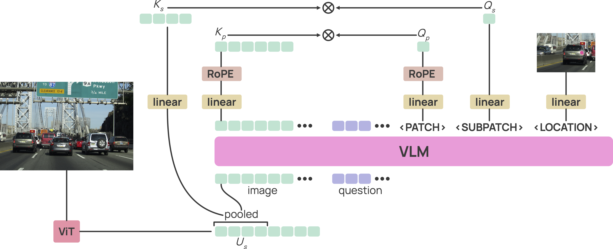

<div align="center">
  
  <br>
  <br>
  <h1>MolmoPoint: Better Pointing for VLMs with Grounding Tokens</h1>
</div>
<p align="center">
  <a href="https://github.com/allenai/molmo2/LICENSE">
    
  </a>
  <a href="https://allenai.org/papers/molmopoint">
    
  </a>
  <a href="https://allenai.org/blog/molmopoint">
    
  </a>
  <a href="https://huggingface.co/collections/allenai/molmopoint">
    
  </a>
  <a href="https://huggingface.co/collections/allenai/molmopoint-data">
    
  </a>
</p>


MolmoPoint is a version of Molmo2 that uses a dot-product based attention mechanism for pointing that improves
pointing and tracking performance.

<div align="center">
  
</div>

See our [blog post](https://allenai.org/blog/molmopoint) or our [paper](https://allenai.org/papers/molmopoint) for more details about Molmo2.
Huggingface models can be found [here](https://huggingface.co/collections/allenai/molmopoint).
See the [README](https://github.com/allenai/molmo2/blob/main/README.md) for more information about the codebase
and how to install this codebase.

# Training and Evaluations

## Checkpoints
We release model weights after pre-training, SFT, and long-context SFT in a format compatible
with this codebase. The Long-Context SFT Checkpoint matches the hugging face repo checkpoints,
but have a slightly different format. The config files are backwards-compatible with
this repo but might not match exactly.

<table>
  <tr>
    <td><a href="https://huggingface.co/allenai/MolmoPoint-8B">MolmoPoint-8B</a></td>
    <td><a href="https://storage.googleapis.com/oe-training-public/MolmoPoint-0325/MolmoPoint-8B-Pretrain.tar">Pretrain</a></td>
    <td><a href="https://storage.googleapis.com/oe-training-public/MolmoPoint-0325/MolmoPoint-8B-SFT.tar">SFT</a></td>
    <td><a href="https://storage.googleapis.com/oe-training-public/MolmoPoint-0325/MolmoPoint-8B.tar">Long-Context SFT</a></td>
  </tr>
  <tr>
    <td><a href="https://huggingface.co/allenai/MolmoPoint-Vid-4B">MolmoPoint-Vid-4B</a></td>
    <td><a href="https://storage.googleapis.com/oe-training-public/MolmoPoint-0325/MolmoPoint-Vid-4B-Pretrain.tar">Pretrain</a></td>
    <td><a href="https://storage.googleapis.com/oe-training-public/MolmoPoint-0325/MolmoPoint-Vid-4B-SFT.tar">SFT</a></td>
    <td><a href="https://storage.googleapis.com/oe-training-public/MolmoPoint-0325/MolmoPoint-Vid-4B.tar">Long-Context SFT</a></td>
  </tr>
  <tr>
    <td><a href="https://huggingface.co/allenai/MolmoPoint-GUI-8B">MolmoPoint-GUI-8B</a></td>
    <td>-</td>
    <td><a href="https://storage.googleapis.com/oe-training-public/MolmoPoint-0325/MolmoPoint-GUI-8B.tar">SFT</a></td>
    <td>-</td>
  </tr>
</table>

## Pre-Training
Use the same pre-train script but with the `--model=molmo_point` flag:

```bash
torchrun --nproc-per-node=8 launch_scripts/pretrain.py \ 
  qwen3_4b_instruct \
  --save_folder=/path/to/save/folder \ 
  --model=molmo_point
```

## SFT
Multitask training is also done with `launch_scripts/sft.py`, but should use the `molmo_point` training
mixture:

```bash
torchrun --nproc-per-node=8 launch_scripts/sft.py \
   /path/to/pretrained/model \ 
   molmo_point \
  --save_folder=/path/to/save/folder \
  --global_batch_size=160 \
  --max_duration=22000
```

## Long-Context SFT Training
Trained with the same script, like:

```bash
torchrun --nproc-per-node=8 l launch_scripts/train_image_video_sft.py 
    /path/to/sft/model \
    molmo_point_long_context \  
    --global_train_batch_size=160 \ 
    --max_duration=2000 \
    --device_batch_size=1 \
    --seq_len=37376 \
    --model.mm_preprocessor.video.max_frames=384 \
    --model.llm.max_sequence_length=37376 \
    --save_folder=/path/to/long/context/save/folder
```

## GUI Fine-Tuning
MolmoPoint-GUI was trained starting from MolmoPoint-8B like this:

```bash
torchrun --nproc-per-node=8 launch_scripts/train_gui_pointing.py \
   MolmoPoint-8B \ 
  --save_folder=MolmoPoint-GUI-8B
```

## Evaluation
Evaluation works with the same `eval_molmo2` script Molmo2, just point it to a MolmoPoint checkpoint.

For example:

```
torchrun --nproc-per-node 2 launch_scripts/eval_molmo2.py MolmoPoint-GUI-8B screen_spot_pro --skip_if_metrics_cached=False --model.mm_preprocessor.image.max_crops=64
```


## MolmoPoint Transformers Inference
MolmoPoint's HF inference works the same Molmo2, but we recommend running it with
with `logits_processor=model.build_logit_processor_from_inputs(model_inputs)`
to enforce points tokens are generated correctly.

In MolmoPoint, instead of coordinates points will be generated as a series of special
tokens, to decode the tokens back into points requires some additional
metadata from the preprocessor.
The metadata is returned by the preprocessor using the `return_pointing_metadata` flag.
Then `model.extract_image_points` and `model.extract_video_points` do the decoding, they
return a list of (object_id, {image_num|timestamps}, pixel_x, pixel_y) output points.

Note the huggingface MolmoPoint model does not support training.

## Convert Checkpoint to Hugging Face Format
Convert MolmoPoint with
```bash
# N: 36864 for Molmo2-4B and Molmo2-8B, 65536 for Molmo2-O-7B
python3 -m olmo.hf_model.convert_molmo_point_to_hf \
    /path/to/your/checkpoint/dir \
    /path/to/output/dir \
    --override_max_model_len N
```


### Image Pointing Example:

```python
from transformers import AutoProcessor, AutoModelForImageTextToText
import torch
import numpy as np

checkpoint_dir = "allenai/MolmoPoint-8B"  # or path to a converted HF checkpoint

model = AutoModelForImageTextToText.from_pretrained(
    checkpoint_dir,
    trust_remote_code=True,
    dtype="auto",
    device_map="auto",
)

processor = AutoProcessor.from_pretrained(
    checkpoint_dir,
    trust_remote_code=True,
    padding_side="left",
)

image_messages = [
    {
        "role": "user",
        "content": [
            {"type": "text", "text": "Point to the boats"},
            {"type": "image", "image": "https://assets.thesparksite.com/uploads/sites/5550/2025/01/aerial-view-of-boats-yachts-water-bike-and-woode-2023-11-27-04-51-17-utc.jpg"},
            {"type": "image", "image": "https://storage.googleapis.com/ai2-playground-molmo/promptTemplates/Stock_278013497.jpeg"},
        ]
    }
]

inputs = processor.apply_chat_template(
    image_messages,
    tokenize=True,
    add_generation_prompt=True,
    return_tensors="pt",
    return_dict=True,
    padding=True,
    return_pointing_metadata=True
)
metadata = inputs.pop("metadata")
inputs = {k: v.to("cuda") for k, v in inputs.items()}

with torch.inference_mode(), torch.autocast("cuda", dtype=torch.bfloat16):
    output = model.generate(
        **inputs,
        logits_processor=model.build_logit_processor_from_inputs(inputs),
        max_new_tokens=200
    )

generated_tokens = output[:, inputs["input_ids"].size(1):]
generated_text = processor.post_process_image_text_to_text(generated_tokens, skip_special_tokens=False, clean_up_tokenization_spaces=False)[0]
points = model.extract_image_points(
    generated_text,
    metadata["token_pooling"],
    metadata["subpatch_mapping"],
    metadata["image_sizes"]
)

# points as a list of [object_id, image_num, x, y]
# For multiple images, `image_num` is the index of the image the point is in
print(np.array(points))
```

### Video Pointing Example:
```python
video_path = "https://storage.googleapis.com/oe-training-public/demo_videos/many_penguins.mp4"
video_messages = [
    {
        "role": "user",
        "content": [
            dict(type="text", text="Point to the penguins"),
            dict(type="video", video=video_path),
        ]
    }
]

inputs = processor.apply_chat_template(
    video_messages,
    tokenize=True,
    add_generation_prompt=True,
    return_tensors="pt",
    return_dict=True,
    padding=True,
    return_pointing_metadata=True
)
metadata = inputs.pop("metadata")
inputs = {k: v.to("cuda") for k, v in inputs.items()}

with torch.inference_mode(), torch.autocast("cuda", dtype=torch.bfloat16):
    output = model.generate(
        **inputs,
        logits_processor=model.build_logit_processor_from_inputs(inputs),
        max_new_tokens=200
    )

generated_tokens = output[:, inputs['input_ids'].size(1):]
generated_text = processor.post_process_image_text_to_text(generated_tokens, skip_special_tokens=False, clean_up_tokenization_spaces=False)[0]
video_points = model.extract_video_points(
    generated_text,
    metadata["token_pooling"],
    metadata["subpatch_mapping"],
    metadata["timestamps"],
    metadata["video_size"]
)

# points as a list of [object_id, image_num, x, y]
# For tracking, object_id uniquely identifies objects that might appear multiple frames.
print(np.array(video_points))
``` 
